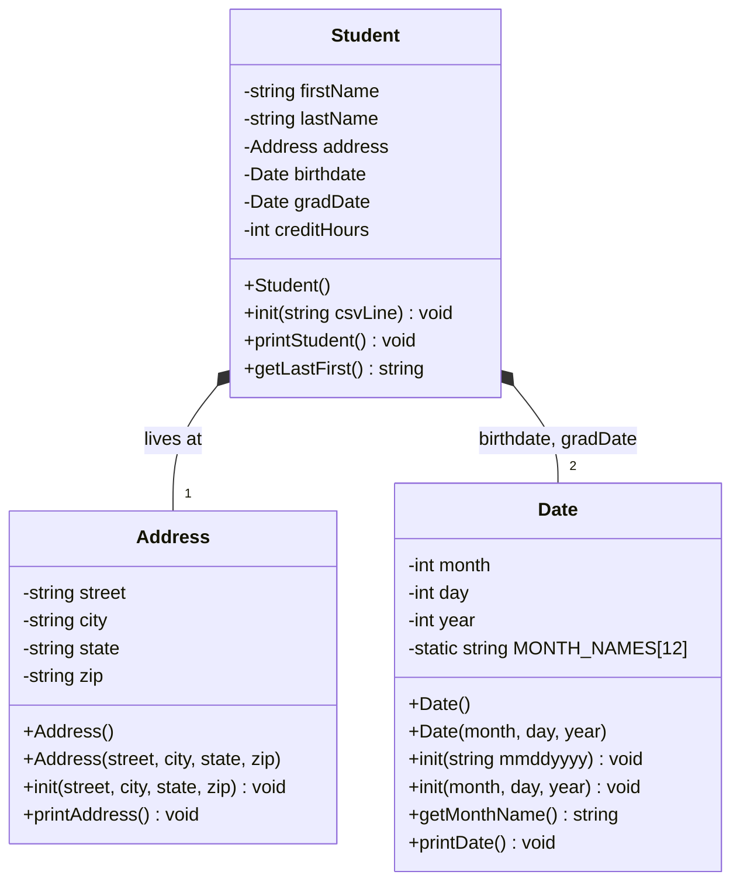

# Heap_of_students_pt1_project

## UML

```mermaid
classDiagram
  class Address {
    -string street
    -string city
    -string state
    -string zip
    +Address()
    +Address(street, city, state, zip)
    +init(street, city, state, zip) void
    +printAddress() void
  }
  class Date {
    -int month
    -int day
    -int year
    -static string MONTH_NAMES[12]
    +Date()
    +Date(month, day, year)
    +init(string mmddyyyy) void
    +init(month, day, year) void
    +getMonthName() string
    +printDate() void
  }
  class Student {
    -string firstName
    -string lastName
    -Address address
    -Date birthdate
    -Date gradDate
    -int creditHours
    +Student()
    +init(string csvLine) void
    +printStudent() void
    +getLastFirst() string
  }
  Student *-- "1" Address : lives at
  Student *-- "2" Date : birthdate, gradDate
```
