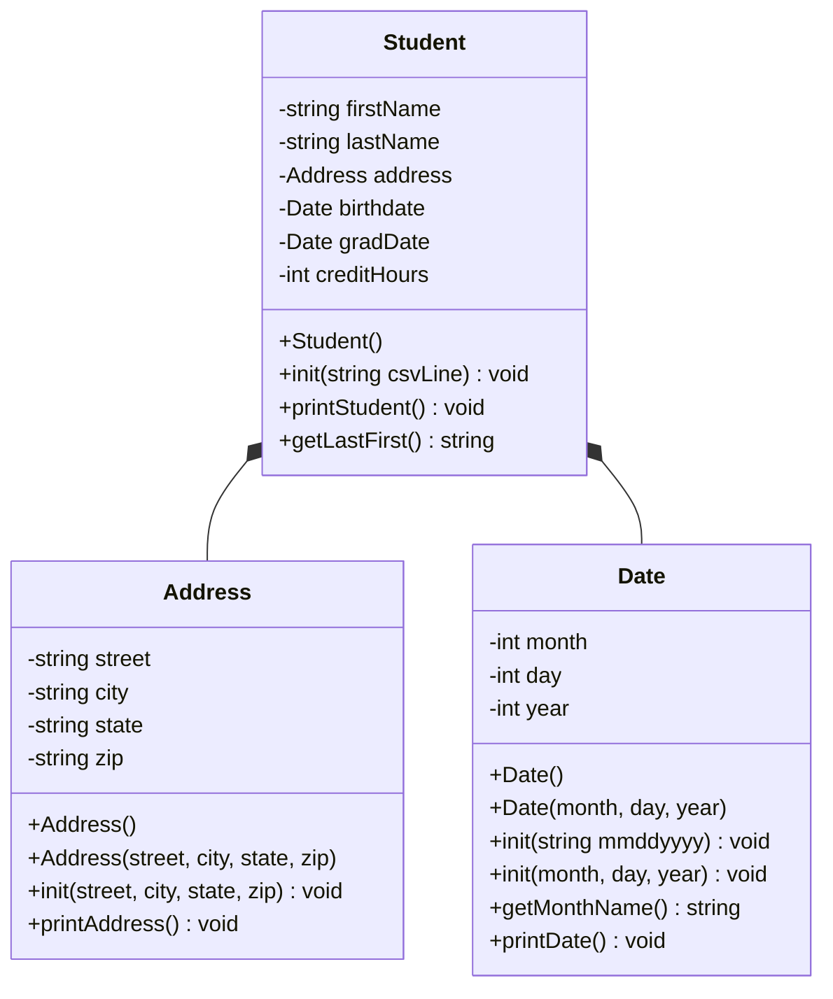

### Student Heap (Part 1)

## Progress
 - I designed the UML for all classes (Address, Date, Student).
 - I also made and tested Address and Date.
 - Student is designed in my UML but will be implemented next week.

## UML



## Design

The data is split into the three classes so each other is prioritizing something different:
- **Address** holds the street, city, state, and zip.
- **Date** holds a day, month, year.
- **Student** holds the name and credit hours, and contains one Address and two Dates.

Each class also has a constructor with no parameters and an `init()` method. I mainly used methods instead of getters and setters, since the data is mostly printed.

## Algorithms


**Date::init(string)** for example takes a date like `01/27/1997`.
 1. Puts the string in stringstream (ss)
 2. Calls `getline` three times with `/` as the seperator for the date as strings.
 3. finally converts each string to an int using the string stream.

**Date::printDate()** prints the month name, the day, a comma, and year, like `January 27, 1997`.

## Build / Run

```
make # build
make run # build and run
make debug # start gdb
make valgrind # check for memory problems
make clean # delete build files
```

